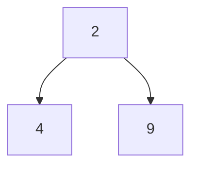

# binary-tree-traversal--task--python

Set of programming assignments that are designed to test knowledge of traversal methods for binary trees.

### Data structure for representing binary trees

You may assume that for all programming assignments within this problem set the following data class
will be used to represent tree nodes:

```python
class TreeNone:
    def __init__(
        self,
        value: int = 0,
        left: Optional['TreeNone'] = None,
        right: Optional['TreeNone'] = None
    ):
        self.value = value
        self.left = left
        self.right = right
```

For example the following tree could be created using the snippet below:




```python
b = TreeNode(value=4)
c = TreeNode(value=9)
a = TreeNode(value=2, left=b, right=c)
```

## Check whether two trees are the same

Given the roots of two binary trees `p` and `q`, write a function to check if they are the same or not.

Two binary trees are considered the same if they are structurally identical, and the nodes have the same value.

**Example 1**
```mermaid
graph BR;
    subgraph A
    A((1))-->B((2))
    A-->C((3))
    end
    subgraph A
    AA((1))-->BB((2))
    AA-->CC((3))
    end  
```

Expected result: True.

**Example 2**
```mermaid
graph BR;
    subgraph A
    A((1))-->B((3))
    A-->C((2))
    end
    subgraph A
    AA((1))-->BB((2))
    AA-->CC((3))
    end  
```

Expected result: False.

**Example 3**
```mermaid
graph BR;
    subgraph A
    A((1))-->B((3))
    A-->C((2))
    C-->D((5))
    C-->F((None))
    end
    subgraph A
    AA((1))-->BB((3))
    AA-->CC((2))
    end  
```

Expected result: False.
