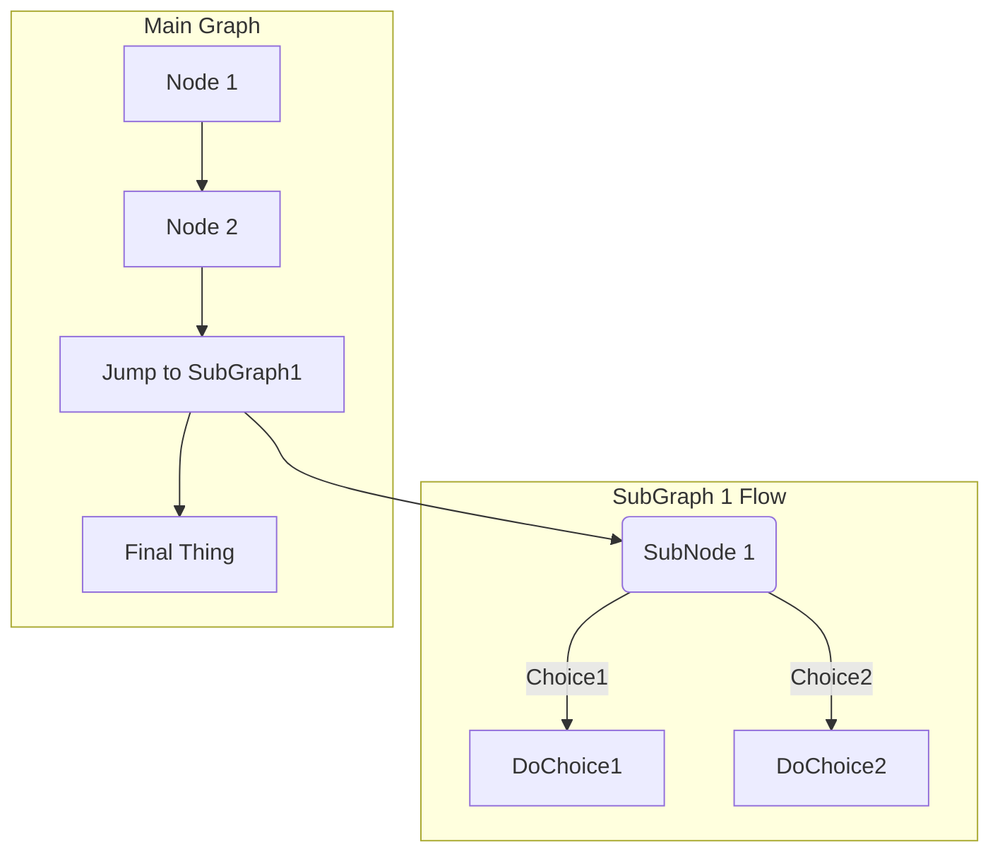

# binary-tree-traversal--task--python

Set of programming assignments that are designed to test knowledge of traversal methods for binary trees.

### Data structure for representing binary trees

You may assume that for all programming assignments within this problem set the following data class
will be used to represent tree nodes:

```python
class TreeNone:
    def __init__(
        self,
        value: int = 0,
        left: Optional['TreeNone'] = None,
        right: Optional['TreeNone'] = None
    ):
        self.value = value
        self.left = left
        self.right = right
```

For example the following tree could be created using the snippet below:





Please use a template for the implementation (`tasks/numbers_and_math.py:get_function_value_in_point`).

Please use a template for the implementation (`tasks/str_operations.py:crack_cipher`).
